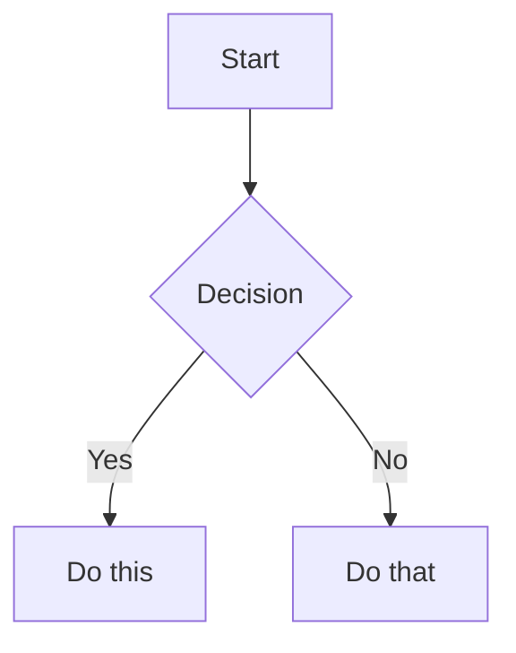

# obsidian-markdown

## Overview

Create and edit valid Obsidian Flavored Markdown (OFM) that also follows a compact note house style.

## Vault Access

Use the `obsidian-cli` skill for all note creation, edit, search, and property mutation inside the vault. Do not shell out to raw `cat`/`sed` on vault paths. See the `obsidian-cli` SKILL.md for the command surface and required preconditions (Obsidian must be running).

OFM extends CommonMark and GFM with wikilinks, embeds, callouts, properties, comments, and other syntax; this skill covers those extensions and bakes a compact note house style (heading, spacing, note-style, web-link, tab-indentation, and bullet-depth rules) into every note it produces. Standard Markdown (bold, italic, code blocks, tables) is assumed knowledge.

## When to Use

- Creating or editing any `.md` file that will live inside an Obsidian vault.
- The user asks for wikilinks, embeds, callouts, frontmatter, tags, comments, highlights, or Mermaid diagrams.
- The user writes in Korean and mentions "옵시디언 노트", "콜아웃", "프론트매터", "태그", "임베드".

**NOT for:**
- Plain GitHub or generic Markdown where OFM syntax would render as raw text.
- SKILL.md or other agent-facing meta-documentation -- those follow the agent-skills spec (which uses an H1 title) and are exempt from the note-formatting rules below.

## Workflow

1. **Add frontmatter** with properties (title, tags, aliases) at the top of the file. See [PROPERTIES.md](PROPERTIES.md) for all property types.
2. **Write content** using standard Markdown for structure, plus the OFM syntax below.
3. **Link related notes** using wikilinks (`[[Note]]`) for internal vault connections, and standard Markdown links for external URLs.
4. **Embed content** from other notes, images, or PDFs using `![[embed]]`. See [EMBEDS.md](EMBEDS.md).
5. **Add callouts** for highlighted information using `> [!type]`. See [CALLOUTS.md](CALLOUTS.md).
6. **Check formatting against the Formatting Rules below** -- main sections default `##`, subsections `####`, hyphen bullets with tabs, no H1/H5+, no bullet past depth 3, no blank lines in body structure, note-style phrasing, and web links as footnotes. Fix before moving on.
7. **Verify** the note renders correctly in Obsidian's reading view.

> When choosing between wikilinks and Markdown links: use `[[wikilinks]]` for notes within the vault (Obsidian tracks renames automatically) and `[text](url)` for external URLs only.

## Formatting Rules

Apply to every note created or edited under this skill. These rules override whatever example headings, spacing, link, or bullet formats appear in upstream OFM references.

### Rule 1: Headings default to `##` for main sections and `####` for subsections

Use the heading level specified by the user for main sections. If no heading level is specified, use `##` (H2) as the default. For subsections inside main sections, use `####` (H4). Avoid `###` unless the user explicitly asks for a three-level outline. Never use `#` (H1) and never use `#####`/`######` (H5/H6).

- **Why no H1:** The note title lives in the filename and the frontmatter `title` property -- an H1 inside the body duplicates it and breaks outline renderers that treat the filename as the document title.
- **Why default `##` / `####`:** This house style treats H2 as the main note outline and H4 as local subsection labels.
- **Why no H5+:** If a section needs to nest past H4, the section is doing too much -- split it into sibling sections, promote it to its own note, or flatten the hierarchy.

```markdown
# Project Alpha            <- BAD: H1 duplicates the title
## Project Alpha           <- GOOD: default main section
#### Tasks                 <- GOOD: subsection inside a main section
### Backend                <- AVOID unless explicitly requested
##### API routes           <- BAD: H5 -- restructure instead
```

### Rule 2: Bullets use hyphen markers and tab indentation

Use a single hyphen followed by one space (`- `) for every bullet point. For nested bullets, indent each level with one tab character. Maintain consistent indentation for bullets at the same level.

Top-level bullet counts as depth 1. A bullet indented once is depth 2. Indented twice is depth 3. A fourth level is not allowed -- promote it to a subsection, a separate list, or note-style line.

```markdown
- Phase one                 <- depth 1 (GOOD)
	- Backend                 <- depth 2 (GOOD)
		- Auth rewrite          <- depth 3 (GOOD, deepest allowed)
			- JWT rotation        <- depth 4 (BAD: flatten or promote)
```

Fix by promoting:

```markdown
- Phase one
	- Backend
		- Auth rewrite: see details
#### Auth rewrite details
- JWT rotation
- Session invalidation
```

### Rule 3: No blank lines inside the note body structure

Do not insert blank lines before or after headings. Do not insert blank lines between different sections, subsections, or bullet lists. Keep the body compact and note-like.

```markdown
## Main Section
Content of the main section.
#### Subsection
- Bullet point 1
- Bullet point 2
	- Nested bullet point
## Another Main Section
More content here.
```

### Rule 4: Prefer note-style phrasing over prose

Use concise note-style lines instead of full-sentence essay prose. Use colons (`:`) for definitions, labels, and readable key-value phrasing.

```markdown
## Concept
Definition: short explanation
Use case: when the idea applies
- Implication: concise note
```

### Rule 5: Preserve source text unless formatting is requested

When the task is to format given text, do not add additional content or modify the source meaning. Only apply the required markdown formatting, heading levels, bullet indentation, and link/footnote formatting.

### Rule 6: Use markdown footnotes for web links

When adding web links in Obsidian notes, prefer markdown footnotes so the body stays note-like. Use inline source labels and collect URLs in footnotes. If the user explicitly asks for a `References` section, use heading `## References` and standard markdown links there.

```markdown
Claim: source summary[^1]
[^1]: [Title](https://example.com)
```

YAML frontmatter is the exception: keep YAML-standard spaces for arrays and nested properties.

## Internal Links (Wikilinks)

```markdown
[[Note Name]]                          Link to note
[[Note Name|Display Text]]             Custom display text
[[Note Name#Heading]]                  Link to heading
[[Note Name#^block-id]]                Link to block
[[#Heading in same note]]              Same-note heading link
```

Define a block ID by appending `^block-id` to any paragraph:

```markdown
This paragraph can be linked to. ^my-block-id
```

For lists and quotes, place the block ID on a separate line after the block:

```markdown
> A quote block

^quote-id
```

## Embeds

Prefix any wikilink with `!` to embed its content inline:

```markdown
![[Note Name]]                         Embed full note
![[Note Name#Heading]]                 Embed section
![[image.png]]                         Embed image
![[image.png|300]]                     Embed image with width
![[document.pdf#page=3]]               Embed PDF page
```

See [EMBEDS.md](EMBEDS.md) for audio, video, search embeds, and external images.

## Callouts

```markdown
> [!note]
> Basic callout.

> [!warning] Custom Title
> Callout with a custom title.

> [!faq]- Collapsed by default
> Foldable callout (- collapsed, + expanded).
```

Common types: `note`, `tip`, `warning`, `info`, `example`, `quote`, `bug`, `danger`, `success`, `failure`, `question`, `abstract`, `todo`.

See [CALLOUTS.md](CALLOUTS.md) for the full list with aliases, nesting, and custom CSS callouts.

## Properties (Frontmatter)

```yaml
---
title: My Note
date: 2024-01-15
tags:
  - project
  - active
aliases:
  - Alternative Name
cssclasses:
  - custom-class
---
```

Default properties: `tags` (searchable labels), `aliases` (alternative note names for link suggestions), `cssclasses` (CSS classes for styling). See [PROPERTIES.md](PROPERTIES.md) for all property types, tag syntax rules, and advanced usage.

## Tags

```markdown
#tag                    Inline tag
#nested/tag             Nested tag with hierarchy
```

Tags can contain letters, numbers (not first character), underscores, hyphens, and forward slashes. Tags can also be defined in frontmatter under the `tags` property.

## Comments

```markdown
This is visible %%but this is hidden%% text.

%%
This entire block is hidden in reading view.
%%
```

## Highlight

```markdown
==Highlighted text==
```

## Math (LaTeX)

```markdown
Inline: $e^{i\pi} + 1 = 0$

Block:
$$
\frac{a}{b} = c
$$
```

## Diagrams (Mermaid)

````markdown

````

To link Mermaid nodes to Obsidian notes, add `class NodeName internal-link;`.

## Footnotes

```markdown
Text with a footnote[^1].

[^1]: Footnote content.

Inline footnote.^[This is inline.]
```

## Complete Example

This example obeys the house style: main sections are `##`, subsections are `####`, nested bullets use tabs, the body has no blank lines between headings/sections/lists, and web links are footnoted.

````markdown
---
title: Project Alpha
date: 2024-01-15
tags:
  - project
  - active
status: in-progress
---
## Summary
Aim: improve [[workflow]] with modern techniques
Deadline: first milestone due January 30
Source: project brief[^1]
## Tasks
- [x] Initial planning
- [ ] Development phase
	- [ ] Backend implementation
	- [ ] Frontend design
#### Backend
- Auth service
	- JWT rotation
	- Session store
#### Frontend
- Component library
- Routing rewrite
## Notes
Algorithm: $O(n \log n)$ sorting
Reference: [[Algorithm Notes#Sorting]]
Embed: ![[Architecture Diagram.png|600]]
Reviewed: [[Meeting Notes 2024-01-10#Decisions]]
[^1]: [Project brief](https://example.com/project-alpha)
````

## Common Rationalizations

| Rationalization | Reality |
|---|---|
| "I'll use H1 for the title so it's obvious what the note is about." | The title lives in the filename and frontmatter `title` property. An H1 duplicates them and breaks outline renderers that already treat the filename as the document title. |
| "Just one more indent level -- the structure really is that deep." | Past depth 3 readers lose the outline. Promote the content to a sub-heading, a separate list, or prose. If the data truly has 4+ axes, it's a table, not a list. |
| "This note is a meta-doc, so H5/H6 is fine." | If the note needs H5, it needs to be split. Nothing in an Obsidian note renders better at H5 than it does as its own sibling H3/H4 section. |
| "The upstream kepano example used deeper nesting, so it's fine to copy." | Upstream is a syntax reference, not a style guide. These rules override any nesting shown in references. |
| "Two-space indentation renders fine in Markdown, so it is fine for Obsidian notes." | Rendering is not the only criterion. These note bodies use literal tabs for nested bullets so the source matches Obsidian's outliner behavior. |
| "Blank lines make Markdown easier to read." | This house style is compact: no blank lines before/after headings or between section/list blocks inside the body. |
| "A normal paragraph sounds more polished." | Prefer note-style fragments and colon labels over essay prose unless the user explicitly requests narrative writing. |
| "I'll paste web links inline." | Use markdown footnotes for web links to keep the note body clean. |

## Red Flags

- A leading `# ` line inside the body of an Obsidian note (H1).
- Any `##### ` or `###### ` line (H5/H6).
- Any body bullet indented with spaces instead of literal tabs. YAML frontmatter is exempt.
- A body bullet indented three or more tabs (`^\t{3,}- `), which is depth 4+ and should be promoted or flattened.
- Main sections using `###` when the user did not explicitly request that level.
- Blank lines before or after headings, or between sections/lists in the note body.
- Essay-style full sentences where note-style colon phrasing would preserve the source meaning.
- Raw web URLs or inline web links in the body when a footnote would work.
- Frontmatter `title` plus an H1 restating the same string.

## Verification

- [ ] Frontmatter is present and at least one property is set.
- [ ] `grep -nE '^# ' <note>` returns zero matches (no H1 in body).
- [ ] `grep -nE '^#{5,} ' <note>` returns zero matches (no H5+).
- [ ] Main sections use the user-specified heading level, defaulting to `##`.
- [ ] Subsections inside main sections use `####` unless the user explicitly requested a different outline.
- [ ] `awk 'BEGIN{fm=0} NR==1&&$0=="---"{fm=1;next} fm&&$0=="---"{fm=0;next} !fm && /^ +-/ {print FNR ":" $0}' <note>` returns zero matches (no space-indented body bullets).
- [ ] `grep -nP '^\t{3,}- ' <note>` returns zero matches (no bullet past depth 3 when using tab indentation).
- [ ] Body structure has no blank lines before/after headings or between section/list blocks.
- [ ] Note text uses concise note-style phrasing and colons where appropriate.
- [ ] Web links are represented as markdown footnotes unless the user explicitly requested a `## References` section.
- [ ] Every wikilink resolves to an existing note or is explicitly intended as a placeholder.
- [ ] Callouts use a valid type from [CALLOUTS.md](CALLOUTS.md).
- [ ] The note renders in Obsidian reading view without broken embeds or unrendered syntax.

## References

- [Obsidian Flavored Markdown](https://help.obsidian.md/obsidian-flavored-markdown)
- [Internal links](https://help.obsidian.md/links)
- [Embed files](https://help.obsidian.md/embeds)
- [Callouts](https://help.obsidian.md/callouts)
- [Properties](https://help.obsidian.md/properties)
