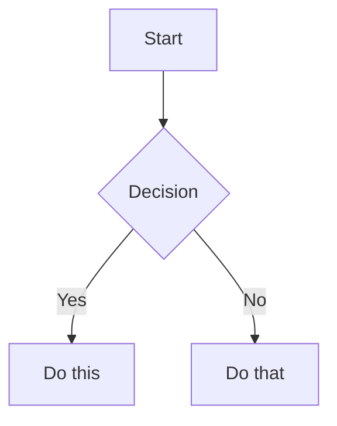

# obsidian-markdown

## Overview

Create and edit valid Obsidian Flavored Markdown (OFM) that also follows a headings-first note house style.

## Vault Access

Use the `obsidian-cli` skill for all note creation, edit, search, and property mutation inside the vault. Do not shell out to raw `cat`/`sed` on vault paths. See the `obsidian-cli` SKILL.md for the command surface and required preconditions (Obsidian must be running).

OFM extends CommonMark and GFM with wikilinks, embeds, callouts, properties, comments, and other syntax; this skill covers those extensions and bakes a headings-first note house style (heading structure, short bullets, tables, numbered lists, spacing, note-style phrasing, date/people wikilinks, and inline web links) into every note it produces. Standard Markdown (bold, italic, code blocks, tables) is assumed knowledge.

## When to Use

- Creating or editing any `.md` file that will live inside an Obsidian vault.
- The user asks for wikilinks, embeds, callouts, frontmatter, tags, comments, highlights, or Mermaid diagrams.
- The user writes in Korean and mentions "옵시디언 노트", "콜아웃", "프론트매터", "태그", "임베드".

**NOT for:**
- Plain GitHub or generic Markdown where OFM syntax would render as raw text.
- SKILL.md or other agent-facing meta-documentation -- those follow the agent-skills spec (which uses an H1 title) and are exempt from the note-formatting rules below.

## Workflow

1. **Add frontmatter** with properties (title, tags, aliases) at the top of the file. See [PROPERTIES.md](PROPERTIES.md) for all property types.
2. **Write content** using standard Markdown for structure, plus the OFM syntax below.
3. **Link related notes** using wikilinks (`[[Note]]`) for internal vault connections, and standard Markdown links for external URLs.
4. **Embed content** from other notes, images, or PDFs using `![[embed]]`. See [EMBEDS.md](EMBEDS.md).
5. **Add callouts** for highlighted information using `> [!type]`. See [CALLOUTS.md](CALLOUTS.md).
6. **Check formatting against the Formatting Rules below** -- structure with headings (main sections `##`, subsections `###`/`####`) rather than deep bullet nesting; bullets hold one idea per line at depth ≤ 2; three-or-more comparable items become a table; sequences and plans become a numbered list; blank lines separate headings, tables, and logical blocks; no H1/H5+; note-style phrasing; body dates as `[[YYYY-MM-DD]]`; person names as `[[Name]]`; external URLs as inline `[text](url)` (not footnotes). Fix before moving on.
7. **Verify** the note renders correctly in Obsidian's reading view.

> When choosing between wikilinks and Markdown links: use `[[wikilinks]]` for notes within the vault (Obsidian tracks renames automatically) and `[text](url)` for external URLs only.

## Formatting Rules

Apply to every note created or edited under this skill. These rules override whatever example headings, spacing, link, or bullet formats appear in upstream OFM references.

### Rule 1: Structure with headings, not nesting

Use headings to carry structure, not bullet indentation. Main sections use `##`. Topical subsections use `###`. Sub-topics inside a subsection use `####`. Never use `#` (H1) -- the note title lives in the filename and frontmatter `title` property, and an H1 duplicates them. Never use `#####`/`######` (H5/H6) -- a section needing that depth should be split into sibling sections instead.

When a bullet tree wants to go three or more levels deep, that is the signal to promote the top level to a heading and flatten the rest -- not to add another indent.

```markdown
# Project Alpha            <- BAD: H1 duplicates the title
## Project Alpha           <- GOOD: main section
### Backend                <- GOOD: topical subsection
#### Auth rewrite          <- GOOD: sub-topic under Backend
##### API routes           <- BAD: H5 -- restructure instead
```

### Rule 2: One idea per bullet, one line per bullet

A bullet holds one fact or one action, on one line. A bullet that chains multiple clauses with arrows (`→`), em-dashes, or parenthetical asides is a paragraph in disguise -- split it into separate bullets or rewrite it as prose under a heading.

```markdown
- Deploy → staging first, then prod after QA signs off (target Friday)   <- BAD: one bullet, three ideas
```

```markdown
- Deploy to staging first
- Deploy to prod after QA signs off
- Target: Friday
```

### Rule 3: Maximum bullet depth is 2

A bullet may have one level of children and no more: depth 1 (top-level) and depth 2 (its direct children). Depth 3+ is an anti-pattern -- promote the deeper content to its own heading instead.

Bullets use a single hyphen followed by one space (`- `). Indent the one allowed child level with a single tab. YAML frontmatter is the exception: keep YAML-standard spaces for arrays and nested properties.

```markdown
- Phase one                 <- depth 1 (GOOD)
	- Backend                 <- depth 2 (GOOD, deepest allowed)
		- Auth rewrite           <- depth 3 (BAD: promote or flatten)
			- JWT rotation         <- depth 4 (BAD)
```

Fix by promoting:

```markdown
- Phase one
	- Backend: see Auth rewrite below

#### Auth rewrite
- JWT rotation
- Session invalidation
```

### Rule 4: Tables for comparative or multi-attribute information

When three or more items share the same set of attributes (tool comparisons, per-item status, location/content/action triples), use a table instead of parallel or nested bullets -- a table makes the shared attributes scannable in a way bullets cannot.

```markdown
- Tool A: fast, no auth support, CLI only
- Tool B: slow, has auth support, CLI and GUI
- Tool C: fast, has auth support, GUI only
```

```markdown
| Tool | Speed | Auth | Interface |
|------|-------|------|-----------|
| A | Fast | No | CLI |
| B | Slow | Yes | CLI, GUI |
| C | Fast | Yes | GUI |
```

### Rule 5: Numbered lists for sequences and ordered plans

Use a numbered list (`1.`, `2.`, `3.`) for steps that happen in order or a plan with a fixed sequence. Never fake numbering inside bullets (`- 1.`, `- 3-1.`) -- the bullet glyph and the number are double signaling the same thing.

```markdown
- 1. Draft the outline        <- BAD: bullet and number both signal order
- 3-1. Review with team       <- BAD: fake sub-numbering
```

```markdown
1. Draft the outline
2. Circulate for feedback
3. Review with team
4. Finalize
```

### Rule 6: Blank lines are allowed and encouraged

Put a blank line around headings, tables, quotes, and between logical blocks. Readability beats compactness. This reverses the older "no blank lines in the body" rule -- that rule is retired.

### Rule 7: Do not mix concern types in one tree

A plan (a sequence), its content design (an artifact's structure), a reference checklist, and rationale are different kinds of information. Give each its own heading section instead of nesting all of them inside one bullet tree.

```markdown
## Plan
1. ...
2. ...

### Content design
| Section | Purpose |
|---|---|
| ... | ... |

### Checklist
- ...

### Rationale
...
```

### Rule 8: Preserve source text unless formatting is requested

When the task is to format given text, do not add additional content or modify the source meaning. Only apply the required markdown formatting, heading levels, bullet depth, date/people wikilinks, and link formatting.

### Rule 9: Use inline markdown links for web URLs

When adding web links in Obsidian notes, use standard inline markdown links: `[label](https://example.com)`.
Do not prefer footnotes (`[^1]` / `[^1]: ...`) for ordinary web URLs — keep the destination readable next to the claim.
If the user asks for a `References` section, use heading `## References` and the same `[label](url)` form there.

```markdown
Demo: [beta console](https://example.com/beta)
Folder: [reviewer uploads](https://drive.google.com/drive/folders/<folder-id>)
```

### Rule 10: Wrap body dates as date wikilinks

In Markdown body text, wrap calendar dates as Obsidian wikilinks: `[[YYYY-MM-DD]]`.
Keep YAML frontmatter date fields as plain `YYYY-MM-DD` scalars so typed metadata stays valid.

Wikilink only a date the source actually states. When the source gives a bare day or month with no year (`January 30`, `마감 30일`), leave it as written rather than inferring a year to complete the `[[YYYY-MM-DD]]` form — Rule 8 forbids supplying facts the source did not.

```markdown
- 마감: [[2026-07-27]] (월) 13:00
- 테스트 기간: 지금 ~ [[2026-07-27]] (월) 13:00
- 1차 마감: January 30          <- year unstated in source: leave as-is
```

```yaml
date_created: 2026-07-26
date_modified: 2026-07-26
```

### Rule 11: Wrap person names as people wikilinks

When the body refers to a person, wrap the name as a wikilink on first mention: `[[Hong Gildong]]`, `[[홍길동]]`.
Use the People-note filename when one exists; when it does not, the wikilink is a deliberate placeholder that the operator may resolve later, so it does not need a target to be correct.
Creating or enriching People notes is out of scope for this skill — say so and stop when the operator asks for one.

## Anti-pattern vs. Good

Before -- a "work order" note that nests a plan, references, and rationale all under one root, with a bullet that chains a whole sentence:

```markdown
## 작업 순서
- 1. 설계 검토 → 팀 리뷰 후 반영 (금요일까지, 우선순위 높음)
	- 참고 자료
		- 기존 문서
			- v1 스펙
				- 변경 이력
		- 관련 이슈: #123
	- 이유: 기존 구조가 확장성이 없고, 순서를 지키지 않으면 다른 팀과 충돌함
- 2. 구현 → 백엔드 먼저, 인증부터 시작
```

After -- the same content split into headings, a numbered plan, a table, and short bullets:

```markdown
## Plan

1. Review the design with the team by Friday (high priority)
2. Implement the backend, starting with auth
3. Implement the frontend
4. Ship

### Reference Materials

| Type | Item |
|------|------|
| Doc | v1 spec |
| Issue | #123 |

### Rationale

- Current structure does not scale; skipping the review order risks conflicts with other teams
```

## Internal Links (Wikilinks)

```markdown
[[Note Name]]                          Link to note
[[Note Name|Display Text]]             Custom display text
[[Note Name#Heading]]                  Link to heading
[[Note Name#^block-id]]                Link to block
[[#Heading in same note]]              Same-note heading link
```

Define a block ID by appending `^block-id` to any paragraph:

```markdown
This paragraph can be linked to. ^my-block-id
```

For lists and quotes, place the block ID on a separate line after the block:

```markdown
> A quote block

^quote-id
```

## Embeds

Prefix any wikilink with `!` to embed its content inline:

```markdown
![[Note Name]]                         Embed full note
![[Note Name#Heading]]                 Embed section
![[image.png]]                         Embed image
![[image.png|300]]                     Embed image with width
![[document.pdf#page=3]]               Embed PDF page
```

See [EMBEDS.md](EMBEDS.md) for audio, video, search embeds, and external images.

## Callouts

```markdown
> [!note]
> Basic callout.

> [!warning] Custom Title
> Callout with a custom title.

> [!faq]- Collapsed by default
> Foldable callout (- collapsed, + expanded).
```

Common types: `note`, `tip`, `warning`, `info`, `example`, `quote`, `bug`, `danger`, `success`, `failure`, `question`, `abstract`, `todo`.

See [CALLOUTS.md](CALLOUTS.md) for the full list with aliases, nesting, and custom CSS callouts.

## Properties (Frontmatter)

```yaml
---
title: My Note
date: 2024-01-15
tags:
  - project
  - active
aliases:
  - Alternative Name
cssclasses:
  - custom-class
---
```

Default properties: `tags` (searchable labels), `aliases` (alternative note names for link suggestions), `cssclasses` (CSS classes for styling). See [PROPERTIES.md](PROPERTIES.md) for all property types, tag syntax rules, and advanced usage.

## Tags

```markdown
#tag                    Inline tag
#nested/tag             Nested tag with hierarchy
```

Tags can contain letters, numbers (not first character), underscores, hyphens, and forward slashes. Tags can also be defined in frontmatter under the `tags` property.

## Comments

```markdown
This is visible %%but this is hidden%% text.

%%
This entire block is hidden in reading view.
%%
```

## Highlight

```markdown
==Highlighted text==
```

## Math (LaTeX)

```markdown
Inline: $e^{i\pi} + 1 = 0$

Block:
$$
\frac{a}{b} = c
$$
```

## Diagrams (Mermaid)

````markdown

```mermaid
graph TD
    A[Start] --> B{Decision}
    B -->|Yes| C[Do this]
    B -->|No| D[Do that]
```
````

To link Mermaid nodes to Obsidian notes, add `class NodeName internal-link;`.

## Footnotes

Footnote syntax exists in OFM, but this house style does not use it for web links (see Rule 9).
Reserve footnotes only when the operator explicitly asks for them.

```markdown
Text with a footnote[^1].

[^1]: Footnote content.

Inline footnote.^[This is inline.]
```

## Complete Example

This example obeys the house style: main sections are `##`, topical subsections are `###`, bullets hold one idea per line at depth ≤ 2, blank lines separate blocks, body dates and people are wikilinked, and web links are inline markdown.

````markdown
---
title: Project Alpha
date: 2024-01-15
tags:
  - project
  - active
status: in-progress
---

## Summary

- Aim: improve [[workflow]] with modern techniques
- Owner: [[Hong Gildong]]
- Deadline: [[2024-01-30]]
- Source: [project brief](https://example.com/project-alpha)

## Tasks

1. Initial planning
2. Backend implementation
3. Frontend design
4. Review

### Backend

- Auth service
	- JWT rotation
	- Session store

### Frontend

- Component library
- Routing rewrite

## Notes

Algorithm: $O(n \log n)$ sorting

Reference: [[Algorithm Notes#Sorting]]

Embed: ![[Architecture Diagram.png|600]]

Reviewed: [[Meeting Notes 2024-01-10#Decisions]]
````

## Common Rationalizations

| Rationalization | Reality |
|---|---|
| "I'll use H1 for the title so it's obvious what the note is about." | The title lives in the filename and frontmatter `title` property. An H1 duplicates them and breaks outline renderers that already treat the filename as the document title. |
| "Just one more indent level -- the structure really is that deep." | Past depth 2, readers lose the outline. That's what headings are for -- promote the deeper content to a `###`/`####` section instead of nesting again. |
| "This note is a meta-doc, so H5/H6 is fine." | If the note needs H5, it needs to be split. Nothing in an Obsidian note renders better at H5 than it does as its own sibling H3/H4 section. |
| "I'll chain a few ideas with arrows so the bullet stays terse." | A bullet chaining clauses with `→`, em-dashes, or parentheticals is a paragraph in disguise. Split it into separate bullets or write it as prose under a heading. |
| "Nesting the plan, references, and reasoning under one root keeps it all together." | A sequence, an artifact's structure, a reference list, and rationale are different kinds of information. Give each its own heading section instead of one bullet tree. |
| "I'll number inside the bullet so the order is extra clear." | `- 1.` / `- 3-1.` double-signals order with both a bullet glyph and a number. Use a numbered list instead. |
| "These three items are similar enough for a bullet list." | Three or more items sharing the same attributes belong in a table, not parallel or nested bullets. |
| "Blank lines make the note longer than it needs to be." | Blank lines around headings, tables, and blocks are encouraged. Readability beats compactness. |
| "I'll hide web links in footnotes." | Use inline `[label](url)` for web links; footnotes are not the house default. |
| "Bare dates and bare names are fine in the body." | Body dates are `[[YYYY-MM-DD]]`; person names are `[[Name]]` wikilinks. |

## Red Flags

- A leading `# ` line inside the body of an Obsidian note (H1).
- Any `##### ` or `###### ` line (H5/H6).
- Any body bullet indented with spaces instead of literal tabs. YAML frontmatter is exempt.
- A body bullet indented two or more tabs (`^\t{2,}- `), which is depth 3+ and should be promoted to a heading.
- A bullet whose text contains `→`, an em-dash used as a clause joiner, or a parenthetical aside chaining a second idea.
- Fake numbering inside a bullet (`- 1.`, `- 3-1.`).
- Three or more parallel bullets sharing the same attributes that should be a table instead.
- A plan, a reference list, and rationale all nested under one heading or bullet root instead of split into their own sections.
- Essay-style full sentences where note-style colon phrasing would preserve the source meaning.
- Footnotes (`[^n]`) used for ordinary web URLs when inline `[label](url)` would work.
- Bare ISO dates in the body (`2026-07-27`) instead of `[[2026-07-27]]`.
- Bare person names in the body when a `[[Name]]` wikilink is available.
- Frontmatter `title` plus an H1 restating the same string.

## Verification

- [ ] Frontmatter is present and at least one property is set.
- [ ] `grep -nE '^# ' <note>` returns zero matches (no H1 in body).
- [ ] `grep -nE '^#{5,} ' <note>` returns zero matches (no H5+).
- [ ] Structure is carried by headings (`##` main sections, `###`/`####` subsections), not by deep bullet nesting.
- [ ] `awk 'BEGIN{fm=0} NR==1&&$0=="---"{fm=1;next} fm&&$0=="---"{fm=0;next} !fm && /^ +-/ {print FNR ":" $0}' <note>` returns zero matches (no space-indented body bullets).
- [ ] `grep -nP '^\t{2,}- ' <note>` returns zero matches (no bullet past depth 2).
- [ ] Every bullet holds one idea on one line -- no `→`/em-dash/parenthetical clause chains.
- [ ] Three-or-more-item comparisons use a table, not parallel or nested bullets.
- [ ] Sequences and ordered plans use a numbered list, not bullets with numbers baked in.
- [ ] Blank lines separate headings, tables, quotes, and logical blocks.
- [ ] A plan, artifact structure, reference checklist, and rationale each live in their own heading section, not nested inside one tree.
- [ ] Note text uses concise note-style phrasing and colons where appropriate.
- [ ] Web links use inline `[label](url)`; footnotes are absent unless the operator explicitly requested them.
- [ ] Body calendar dates use `[[YYYY-MM-DD]]`; YAML date fields stay plain `YYYY-MM-DD`.
- [ ] Person names in the body use `[[Name]]` wikilinks on first mention.
- [ ] Every topical wikilink resolves to an existing note or is explicitly intended as a placeholder. Date wikilinks (Rule 10) and person wikilinks (Rule 11) are intentional placeholders by design and are exempt — an unresolved `[[2026-07-27]]` or `[[홍길동]]` is correct output, not a broken link.
- [ ] Callouts use a valid type from [CALLOUTS.md](CALLOUTS.md).
- [ ] The note renders in Obsidian reading view without broken embeds or unrendered syntax.

## References

- [Obsidian Flavored Markdown](https://help.obsidian.md/obsidian-flavored-markdown)
- [Internal links](https://help.obsidian.md/links)
- [Embed files](https://help.obsidian.md/embeds)
- [Callouts](https://help.obsidian.md/callouts)
- [Properties](https://help.obsidian.md/properties)
