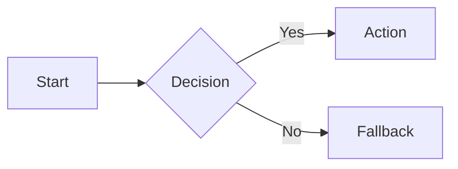

# obsidian-mermaid

Author Mermaid blocks that render in the target Obsidian installation. Success means the
chosen diagram prefix is available in Obsidian's bundled Mermaid version, the block renders
without a parser error, and an older-bundle fallback is available for beta diagram types.

## Compatibility gate

Do not infer Obsidian compatibility from Notion or mermaid.live. Identify the target
Obsidian and bundled Mermaid versions when possible, then run one representative block in
the target renderer. The verified baseline is Obsidian 1.13.1 with Mermaid 11.13.0; all
catalog entries below parse and emit SVG on that baseline.

When the bundle is older or unknown, default to `flowchart`, `sequenceDiagram`,
`classDiagram`, `stateDiagram-v2`, `gantt`, `journey`, or `pie`. Treat prefixes ending in
`-beta` as version-gated and keep a `flowchart` fallback.

## Verified diagram catalog

| Purpose | Prefix | Compatibility note |
| --- | --- | --- |
| Process or decision flow | `flowchart TD` / `flowchart LR` | Default fallback for every structural diagram |
| Object relationships | `classDiagram` | Supports cardinality and labeled relations |
| Message exchange | `sequenceDiagram` | Prefer explicit actor names and arrow semantics |
| Service topology | `architecture-beta` | Version-gated; use a grouped flowchart on older bundles |
| Experience scoring | `journey` | Task score and actor list follow each task label |
| Proportions | `pie` | Quote labels |
| Work status | `kanban` | Verify the bundle before using on older Obsidian releases |
| Hierarchical proportions | `treemap-beta` | Version-gated; use pie or flowchart when unavailable |
| Hierarchy | `mindmap` | Keep indentation exact |
| Milestones | `timeline` | One period followed by one or more events |
| Quantified flow | `sankey` | CSV-like source, target, value rows |
| Bar and line series | `xychart-beta` | Version-gated; keep axes and series lengths aligned |

Use the copy-ready syntax in
[references/diagram-catalog.md](references/diagram-catalog.md) rather than reconstructing
an unfamiliar grammar from memory.

## Syntax constraints

- Use `flowchart`, not `graph`, for the conservative fallback.
- Use `<br>` or a single line instead of `\n` inside labels.
- Quote labels containing `()`, `:`, `/`, or non-ASCII when that grammar accepts quoted
  labels; do not mechanically quote identifiers or architecture service keys.
- Keep subgraph direction advisory: Mermaid ignores it when nodes have external edges.
- Prefer `TD` or `LR`; split a diagram when labels or edges stop being readable rather than
  enforcing an arbitrary node limit.
- Preserve the exact case and suffix of diagram prefixes such as `sequenceDiagram`,
  `stateDiagram-v2`, `architecture-beta`, `treemap-beta`, and `xychart-beta`.

## Process

1. Select the smallest diagram type that expresses the relationship.
2. Apply the compatibility gate before choosing a beta or recently added type.
3. Start from the catalog example and replace labels and data without changing grammar.
4. Put the source in an exact ` ```mermaid ` fence.
5. Render in the target Obsidian installation. A parser-only pass is insufficient when SVG
   generation, icons, or layout is part of the result.
6. If the target blocks Mermaid behind a trust prompt, ask the operator to approve it; do
   not bypass or click a security permission silently.
7. On failure, preserve the intended information in a `flowchart` fallback and report the
   Obsidian and Mermaid versions tested.

## Safe fallback

````markdown

````

## Anti-patterns

- Treating a Notion or mermaid.live render as proof of Obsidian support → test the bundled renderer.
- Using a beta prefix without a fallback → provide an equivalent `flowchart`, pie, or table representation.
- Copying a newer diagram type into a version-pinned note → record the tested Obsidian and Mermaid baseline.
- Forcing all content into one dense diagram → split at a stable process or domain boundary.
- Clicking Obsidian's Mermaid trust prompt during automation → stop and request operator approval.

## Verification

- [ ] Target Obsidian and bundled Mermaid versions are known or compatibility is treated as unknown.
- [ ] Diagram prefix is exact and version-compatible.
- [ ] Labels use grammar-appropriate quoting and contain no literal `\n`.
- [ ] The exact fenced block renders to SVG in the target Obsidian renderer.
- [ ] Beta or recently added types have a conservative fallback.
- [ ] Any trust prompt remains operator-controlled.
