# Verified Diagram Catalog

These copy-ready blocks were renderer-tested on Obsidian 1.13.1's bundled Mermaid 11.13.0.
Use the compatibility gate in the parent skill before applying them to another Obsidian
baseline. The examples derive from the linked Threads catalog but use Obsidian-safe fences
and an explicit fallback policy.

## Table of Contents

1. [Flowchart](#flowchart)
2. [Class diagram](#class-diagram)
3. [Sequence diagram](#sequence-diagram)
4. [Architecture](#architecture)
5. [User journey](#user-journey)
6. [Pie chart](#pie-chart)
7. [Kanban](#kanban)
8. [Treemap](#treemap)
9. [Mindmap](#mindmap)
10. [Timeline](#timeline)
11. [Sankey diagram](#sankey-diagram)
12. [XY chart](#xy-chart)

## Flowchart

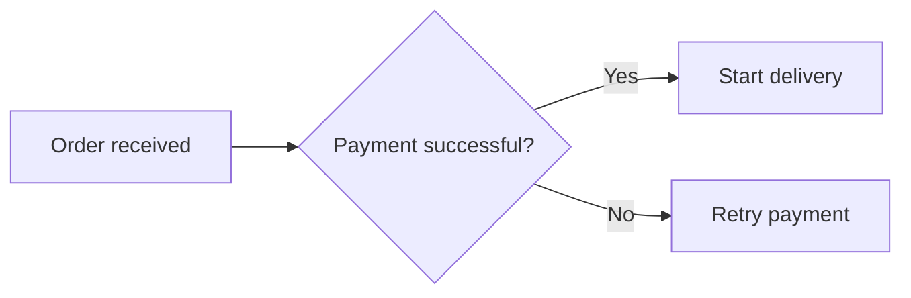

## Class diagram

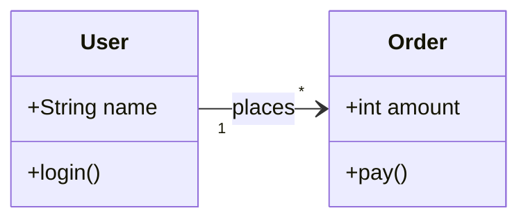

## Sequence diagram

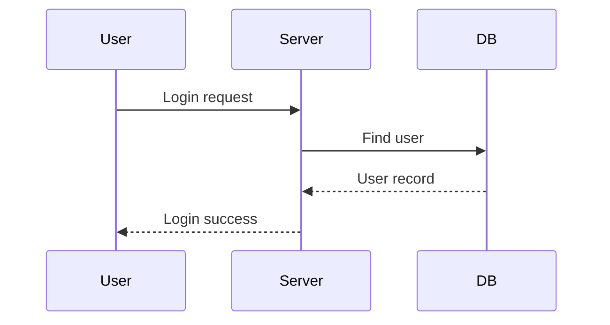

## Architecture

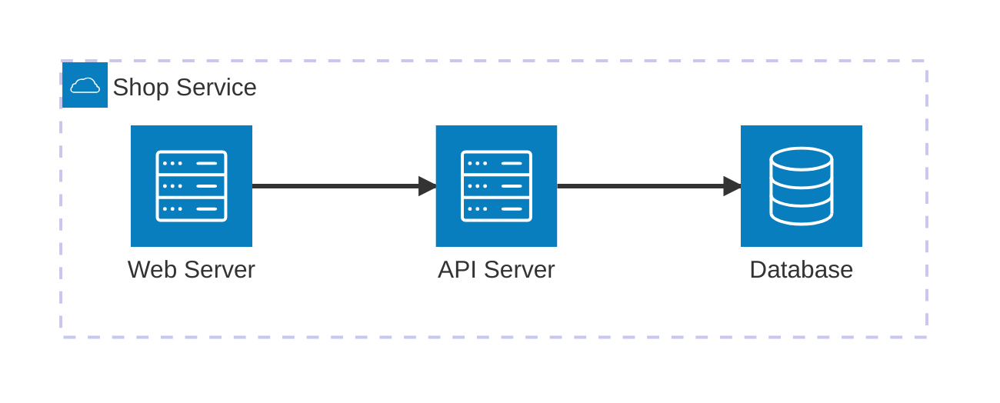

Fallback: use a `flowchart LR` with a subgraph for the service boundary.

## User journey

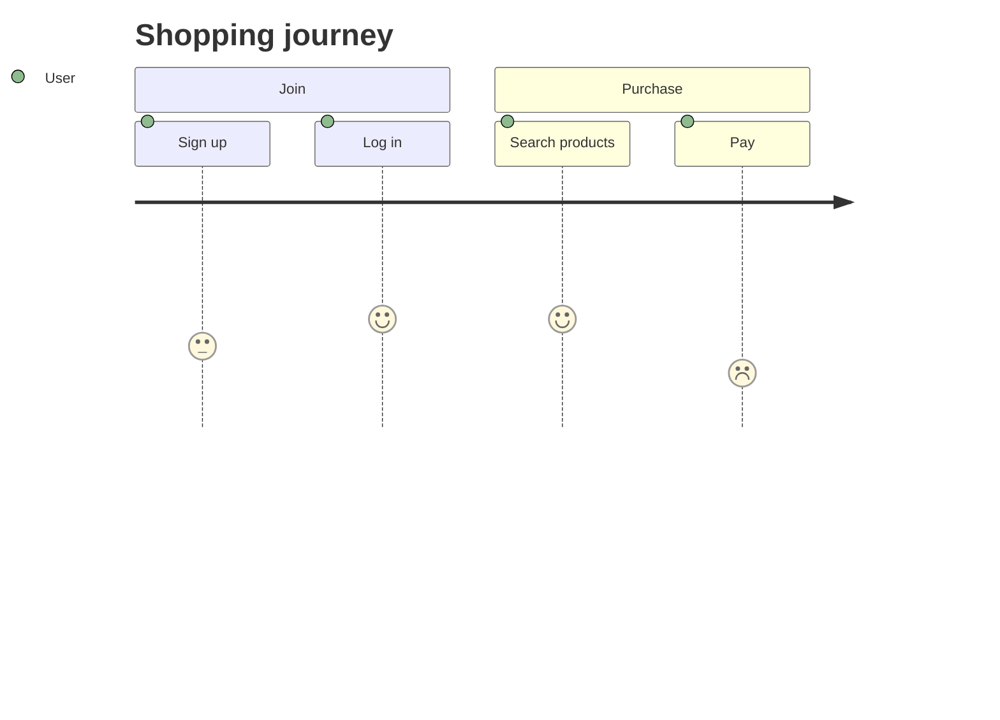

## Pie chart

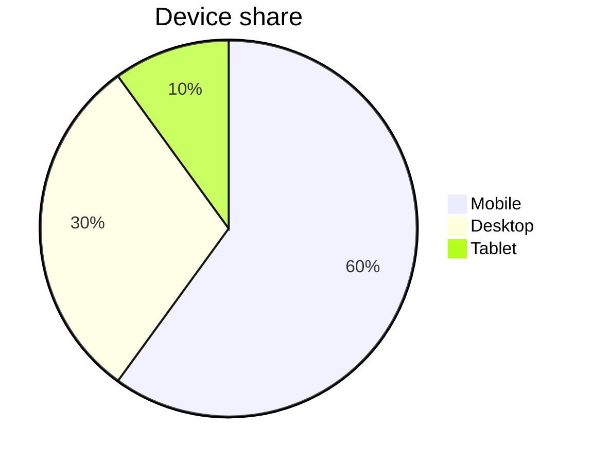

## Kanban

Fallback: use headings with task lists when the target bundle lacks `kanban`.

## Treemap

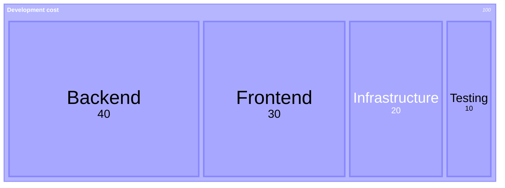

Fallback: use `pie` for a single level or `flowchart` for hierarchy.

## Mindmap

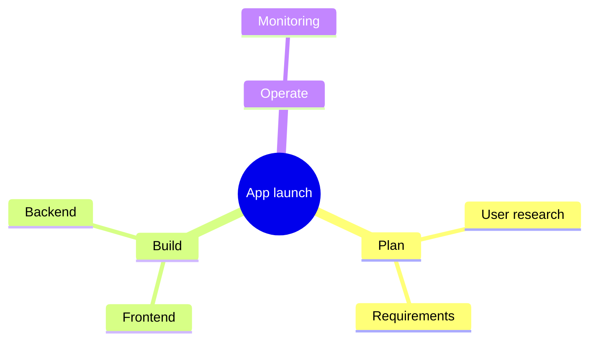

## Timeline

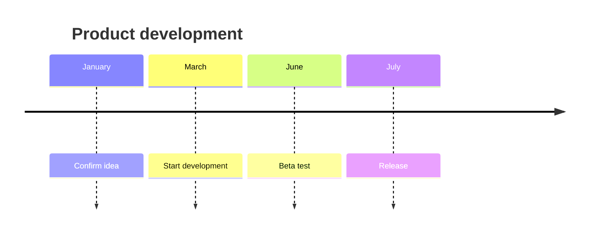

## Sankey diagram

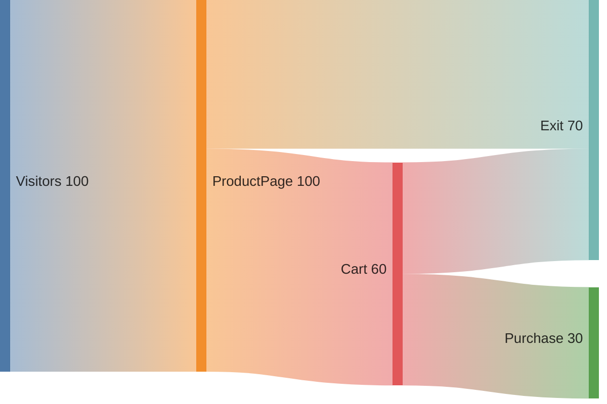

## XY chart

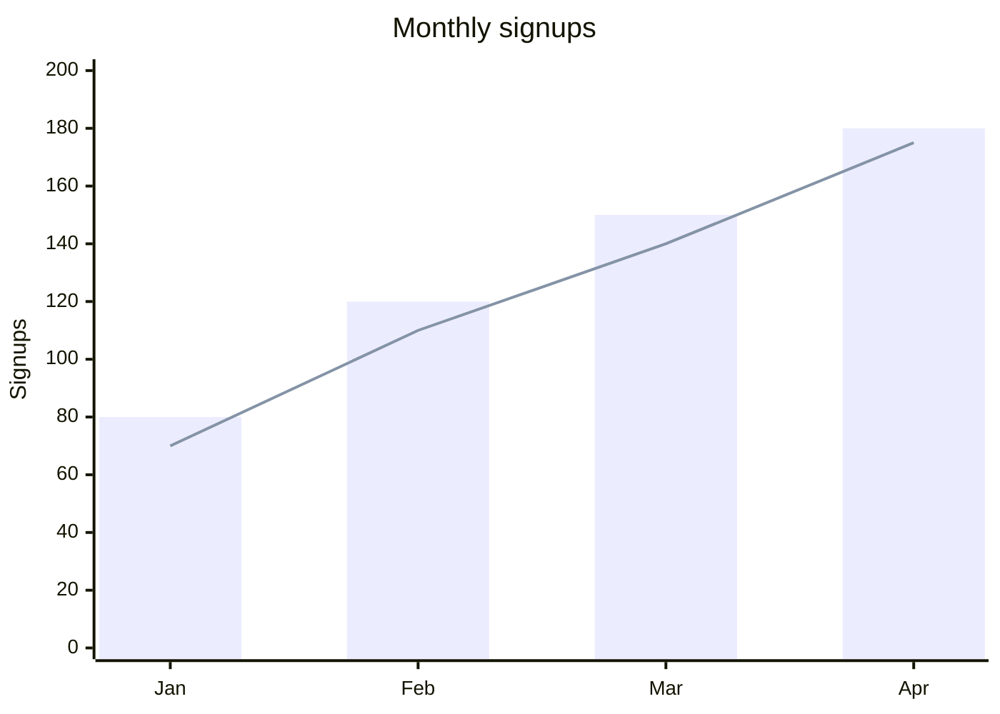
